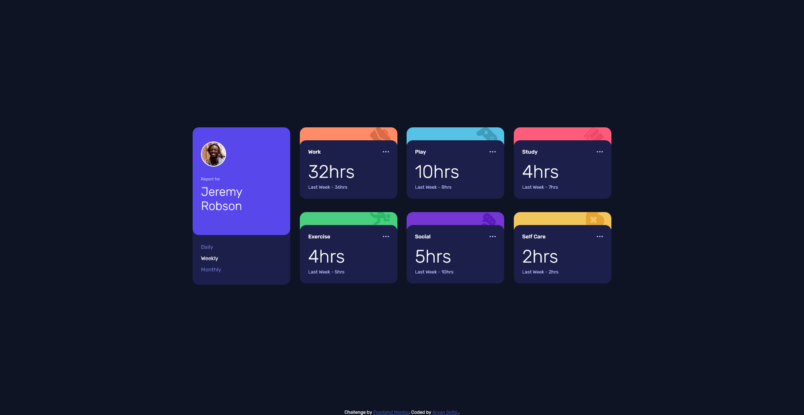
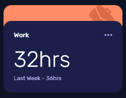

# Frontend Mentor - Time tracking dashboard solution

This is a solution to the [Time tracking dashboard challenge on Frontend Mentor](https://www.frontendmentor.io/challenges/time-tracking-dashboard-UIQ7167Jw). Frontend Mentor challenges help you improve your coding skills by building realistic projects. 

## Table of contents

- [Overview](#overview)
  - [The challenge](#the-challenge)
  - [Screenshot](#screenshot)
  - [Links](#links)
- [My process](#my-process)
  - [Built with](#built-with)
  - [What I learned](#what-i-learned)
  - [Continued development](#continued-development)
  - [Useful resources](#useful-resources)
- [Author](#author)

## Overview

### The challenge

Users should be able to:

- View the optimal layout for the site depending on their device's screen size
- See hover states for all interactive elements on the page
- Switch between viewing Daily, Weekly, and Monthly stats

### Screenshot




### Links

- Solution URL: [Index.html file](./index.html)
- Live Site URL: [Time Tracking Dashboard UI](https://aryan-ki-codepanti.github.io/time-tracking-dashboard-UI/)

## My process

### Built with

- Semantic HTML5 markup
- CSS custom properties
- CSS Grid
-Vanilla Javascript with fetch API and Document object


### What I learned


I learnt quite interesting things while making this project
One of them being having vertically center grid on body with floating bottom footer of attribution

```css
body{
  display: flex;
  min-height: 100vh;
  align-items: center;
}
```
and then floating attribution (position : absolute ) otherwise being in markup flow it would displace above grid from center
```css
.attribution{
  position: absolute;
  bottom:0;
  right:0;
  left:0;
}
```

also the effect in cards (work , play , etc.) where we are having rounded background and another box inside it 


it could be done by negative margins and way i used was to translate below box in Y direction


### Continued development

For future i would like to focus on improving my CSS skills like responsiveness and play about grid systems


### Useful resources

- [MDN dev docs](https://developer.mozilla.org/) - This helped me for tricks and tips and short lookups for CSS and Javascript.

## Author

- Frontend Mentor - [@Aryan-ki-codepanti](https://www.frontendmentor.io/profile/Aryan-ki-codepanti)
- Twitter - [@AryanSe73817078](https://www.twitter.com/AryanSe73817078)
- Youtube - [Channel: Coding Tiger](https://www.youtube.com/channel/UCkz7TnVuNBGEQOTa77lmZfA)

